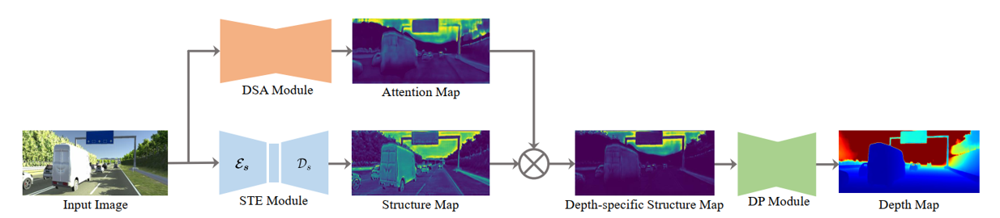

# S2R-DepthNet: Learning a Generalizable Depth-specific Structural Representation

This is the official PyTorch implementation of the paper [***S2R-DepthNet: Learning a Generalizable Depth-specific Structural Representation***](https://arxiv.org/pdf/2104.00877v2.pdf), ***CVPR 2021 (Oral), Xiaotian Chen, Yuwang Wang, Xuejin Chen, and Wenjun Zeng.***


## Citation

```
@inproceedings{Chen2021S2R-DepthNet,
             title = {S2R-DepthNet: Learning a Generalizable Depth-specific Structural Representation},
             author = {Chen, Xiaotian and Wang , Yuwang and Chen, Xuejin and Zeng, Wenjun},
	     conference={IEEE/CVF Conference on Computer Vision and Pattern Recognition (CVPR)},
             year = {2021}   
}
```

## Introduction
Human can infer the 3D geometry of a scene from a sketch instead of a realistic image, which indicates that the spatial structure plays a fundamental role in understanding the depth of scenes. We are the first to explore the learning of a depth-specific structural representation, which captures the essential feature for depth estimation and ignores irrelevant style information. Our S2R-DepthNet (Synthetic to Real DepthNet) can be well generalized to unseen real-world data directly even though it is only trained on synthetic data. S2R-DepthNet consists of: a) a Structure Extraction (STE) module which extracts a domaininvariant structural representation from an image by disentangling the image into domain-invariant structure and domain-specific style components, b) a Depth-specific Attention (DSA) module, which learns task-specific knowledge to suppress depth-irrelevant structures for better depth estimation and generalization, and c) a depth prediction module (DP) to predict depth from the depth-specific representation. Without access of any real-world images, our method even outperforms the state-of-the-art unsupervised domain adaptation methods which use real-world images of the target domain for training. In addition, when using a small amount of labeled real-world data, we achieve the state-of-the-art performance under the semi-supervised setting.
<br>
#### The following figure shows the overview of S2RDepthNet.

<br>
#### Examples of Depth-specific Structural Representation.<br>
<div align=center></div>


## Usage
### Dependencies
- [Python3.6.9](https://www.python.org/downloads/)
- [PyTorch(1.7.1)](https://pytorch.org/)
- [torchvision(0.8.2+cu101)](https://pypi.org/project/torchvision/)
- [TensorboardX(2.1)](https://pypi.org/project/tensorboardX/)
- [matplotlib(3.3.4)](https://matplotlib.org/)
- [Pillow(8.1.2)](https://pypi.org/project/Pillow/)

## Datasets
The outdoor Synthetic Dataset is [vKITTI](http://www.europe.naverlabs.com/Research/Computer-Vision/Proxy-Virtual-Worlds) and outdoor Real dataset is [KITTI](http://www.cvlibs.net/datasets/kitti/)

## TODO

- [x] Trianing Structure Encoder
## Pretrained Models
We also provide our trained models for inference(outdoor and indoor scenes). [Models Link](https://1drv.ms/u/s!AlwUS_9Kpa8qgkb9ldQbMAMgNd_I?e=aX2PWY)

### Train
As an example, use the following command to train S2RDepthNet on vKITTI.<br>
#### *Train Structure Decoder*

	python train.py --syn_dataset VKITTI \            
		        --syn_root "the path of vKITTI dataset" \
		        --syn_train_datafile datasets/vkitti/train.txt \
		        --batchSize 32 \
		        --loadSize 192 640 \          
		        --Shared_Struct_Encoder_path "the path of pretrained Struct encoder(.pth)" \
		        --train_stage TrainStructDecoder                  
			
#### *Train DSA Module and DP module*

	python train.py --syn_dataset VKITTI \
		        --syn_root "the path of vKITTI dataset" \
		        --syn_train_datafile datasets/vkitti/train.txt \
		        --batchSize 32 \
		        --loadSize 192 640 \
		        --Shared_Struct_Encoder_path "the path of pretrained Struct encoder(.pth)" \
			--Struct_Decoder_path "the path of pretrained Structure decoder(.pth)" \
		        --train_stage TrainDSAandDPModule 
	
### Evaluation
Use the following command to evaluate the trained S2RDepthNet on KITTI test data.<br>

	 python test.py --dataset KITTI --root "the path of kitti dataset" --test_datafile datasets/kitti/test.txt --loadSize 192 640 --Shared_Struct_Encoder_path "the path of pretrained Struct encoder(.pth)" --Struct_Decoder_path "the path of pretrained Structure decoder(.pth)" --DSAModle_path "the path of pretrained DSAModle(.pth)" --DepthNet_path "the path of pretrained DepthNet(.pth)" --out_dir "Path to save results"
			
Use the following command to evaluate the trained S2RDepthNet on NYUD-v2 test data.<br>

	 python test.py --dataset NYUD_V2 --root "the path of NYUD_V2 dataset" --test_datafile datasets/nyudv2/nyu2_test.csv --loadSize 192 256 --Shared_Struct_Encoder_path "the path of pretrained Struct encoder(.pth)" --Struct_Decoder_path "the path of pretrained Structure decoder(.pth)" --DSAModle_path "the path of pretrained DSAModle(.pth)" --DepthNet_path "the path of pretrained DepthNet(.pth)" --out_dir "Path to save results"
	
## Acknowledgement
We borrowed code from [GASDA](https://github.com/sshan-zhao/GASDA) and [VisualizationOC](https://github.com/JunjH/Visualizing-CNNs-for-monocular-depth-estimation).
						       
						                      
